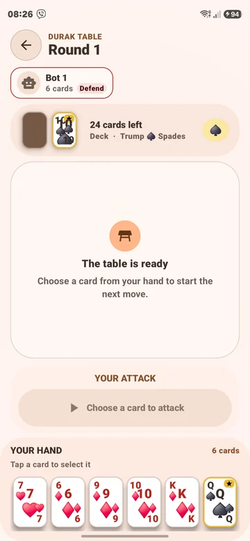
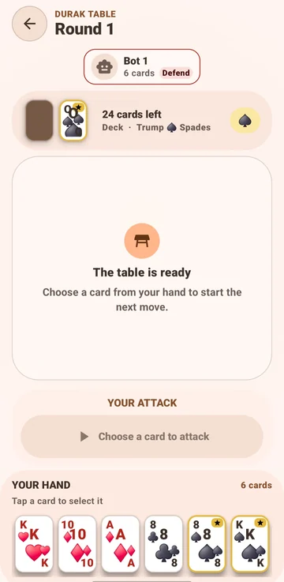
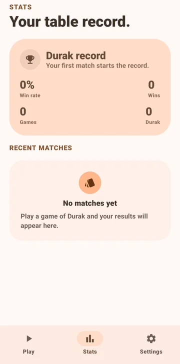

# Card Game Hub

Card Game Hub is a native Android card-game application built with **Kotlin**, **Jetpack Compose**, **Material 3 Expressive**, and **Room**. The current playable experience is an offline, single-player game of **Durak** against local bots. The app is designed around a deterministic game engine and a clear separation between gameplay rules, bot decisions, persistence, and UI.

> **Version 1.0 · Build 1**
>
> A focused first release of the Card Game Hub shell and its offline Durak experience.

## Screenshots

The screenshots below are captured from Card Game Hub and show the current home, gameplay, and settings experiences.

| Home | Game table |
|---|---|
|  |  |

| Stats |
|---|
|  |

## Features

| Area | Included in Build 1 |
|---|---|
| **Offline Durak** | Play a complete local match without an account, server, or network connection. |
| **Local opponents** | Play against classic offline bot opponents with Beginner, Standard, and Expert difficulty levels. |
| **Match configuration** | Choose 2–4 players, a 24-, 36-, or 52-card deck, the Throw-in or Classic game mode, and bot difficulty before dealing. |
| **Durak rules engine** | Validates attacks, legal defenses, throw-ins, bito clearing, taking the table, hand replenishment, turn progression, and end-of-match states. |
| **Responsive table** | The opponent rail and central attack/defense pairs adapt to the available screen width. Cards reduce to a readable minimum and the table automatically scrolls when the final pairs cannot fit at once. |
| **Material 3 Expressive UI** | Uses Material theming, expressive shapes, adaptive layout, responsive typography, semantic controls, and official Material 3 list components. |
| **Adaptive color** | Uses Android dynamic color on Android 12 and newer, with warm Material fallback palettes on earlier supported versions. |
| **Navigation appearance** | Choose the standard labeled Material 3 navigation bar or the compact navigation dock from Settings. The choice is saved locally and applied immediately. |
| **Statistics and history** | Completed matches and aggregate statistics are stored locally through Room. |
| **Privacy by default** | The current game is local-only. No sign-in, analytics service, remote matchmaking, or network permission is required for gameplay. |

## Gameplay

Card Game Hub currently focuses on a clean Durak loop: configure the table, deal the cards, attack, defend or take the table, finish the round, replenish hands, and continue until the match reaches its end state. The engine is deterministic and separated from Compose, which makes the rules testable without rendering the UI.

The main release exposes **Throw-in** and **Classic** Durak modes. Transfer-style rules are reserved for a future rules-engine iteration rather than being presented as an unfinished playable option. The default opponent implementation is a reliable offline tactical bot, so the game remains functional without a network connection.

## Design and interaction

The UI follows Material 3 principles while using the expressive component family available in the current Compose dependency line. The home screen uses a prominent split action for starting a match and opening match settings. Settings use segmented list items with leading, supporting, and trailing slots; the navigation appearance selector changes the real bottom navigation immediately instead of showing a simulated preview.

Advanced settings motion is intentionally deferred from Build 1. The release prioritizes predictable navigation and stable gameplay over experimental screen-transition effects.

## Technical architecture

| Module or package | Responsibility |
|---|---|
| `app/src/main/java/com/example/durak/game` | Deterministic Durak state machine, legal move validation, turn sequencing, and bot-turn recovery. |
| `app/src/main/java/com/example/durak/ai` | Offline bot decision policies for attack, defense, passing, and taking the table. |
| `app/src/main/java/com/example/durak/model` | Cards, suits, players, game modes, difficulties, and validated match configuration. |
| `app/src/main/java/com/example/ui/screens` | Home hub, inline match settings, game table, statistics, history, and settings screens. |
| `app/src/main/java/com/example/ui/viewmodel` | State orchestration between the game engine, Compose UI, and persisted match results. |
| `app/src/main/java/com/example/ui/theme` | Dynamic color, fallback palettes, typography, shapes, and Material 3 theme setup. |
| `app/src/main/java/com/example/data` | Room database entities, DAOs, match history, and transactional statistics persistence. |

The app deliberately keeps future product seams explicit. Additional card games can provide their own rules engine and screen, while online multiplayer can later be introduced behind a dedicated authenticated match service. No future feature is represented as an active online control in the first release.

## Build locally

The repository includes a Gradle wrapper. Use Android Studio or the Android command-line tools with the Android SDK installed, and use the Java toolchain configured by the project.

```bash
./gradlew :app:assembleDebug
```

The debug APK is written to:

```text
app/build/outputs/apk/debug/app-debug.apk
```

To build the optimized release APK used for the v1.0.0 release:

```bash
./gradlew clean :app:testDebugUnitTest :app:assembleRelease --no-daemon --console=plain
```

The release artifact is written to:

```text
app/build/outputs/apk/release/app-release.apk
```

## Tests

Run the complete local unit-test task with:

```bash
./gradlew :app:testDebugUnitTest
```

Run the Durak engine regression suite directly with:

```bash
./gradlew :app:testDebugUnitTest --tests 'com.example.durak.game.DurakEngineTest'
```

The regression coverage includes card hierarchy cases, legal and illegal defenses, throw-in behavior, hand replenishment, completed rounds, end-of-match behavior, and stalled bot-turn recovery.

## Release and R8

Build 1 uses `versionName = "1.0"` and `versionCode = 1`. The release build keeps **R8 code shrinking, optimization, obfuscation, and resource shrinking enabled**.

R8 is a build-time optimizer; it is not a runtime feature that older Android devices need to support. The APK runtime floor is defined by `minSdk = 24` (Android 7.0). Therefore, using R8 does not by itself make the app incompatible with older supported Android versions. The release configuration is retained because it produces a smaller, optimized APK while preserving the same runtime API floor. The release candidate is verified by the Gradle release build and unit tests.

For more information, see the official Android documentation on [code shrinking](https://developer.android.com/studio/build/shrink-code) and [Java 8+ API desugaring](https://developer.android.com/studio/write/java8-support).

## Project status

Card Game Hub is an active first release. The current priority is a polished offline Durak experience with reliable rules, responsive card presentation, adaptive Material 3 theming, and a maintainable architecture for future game modes and multiplayer.

## License

No open-source license has been selected for this repository yet. Until a license is added, all rights are reserved by the repository owner.
